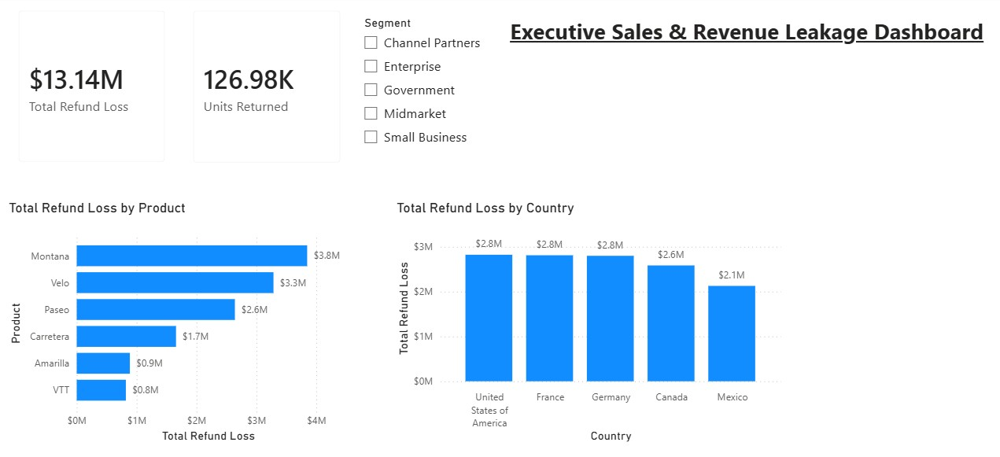

My bad! Here is **one single box** to copy and paste directly into your README.md:

```markdown
# 📊 Executive Sales & Revenue Leakage Dashboard

An end-to-end **Power BI** analysis examining financial impact, return volumes, and product-level revenue leakage across global markets and business segments.



---

## 💡 Executive Summary
* **Total Refund Loss:** **$13.14M** in total revenue leakage across all regions.
* **Units Returned:** **126.98K** total returned units.
* **Primary Risk Driver:** **Montana** ($3.8M) and **Velo** ($3.3M) account for over 50% of total refund losses.

---

## 🛠️ Data Modeling & DAX Measures
Custom measures created using DAX calculations across relational tables:

* **Total Refund Loss:** `Total Refund Loss = SUMX('financials', 'financials'[Sales] * RELATED('Returns'[Return Rate]))`
* **Units Returned:** `Units Returned = SUMX('financials', 'financials'[Units Sold] * RELATED('Returns'[Return Rate]))`

---

## 📊 Key Insights & Visual Features
* **Executive Summary Block:** Top-level KPI cards displaying total monetary loss and returned unit volume.
* **Root-Cause Product Breakdown:** Horizontal bar chart highlighting high-loss product SKUs.
* **Geographic Distribution:** Vertical column chart identifying country-level impact across US, European, and North American markets.
* **Interactive Filtering:** Segment slicer enabling dynamic cross-filtering for Government, Enterprise, Small Business, and Channel Partners.

---

## 📂 Repository Contents
* `Executive_Sales_Revenue_Leakage_Dashboard.pbix` - Complete Power BI Desktop report file.
* `dashboard_preview.jpg` - Dashboard canvas layout screenshot.

```
